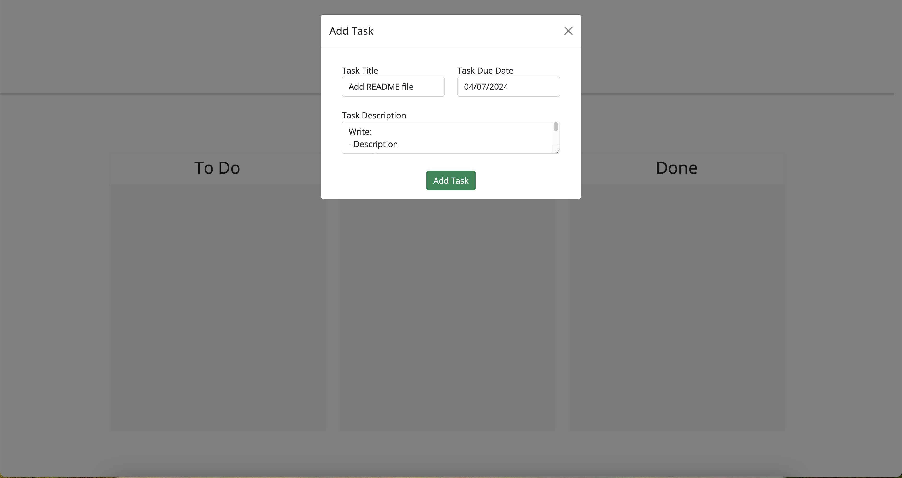
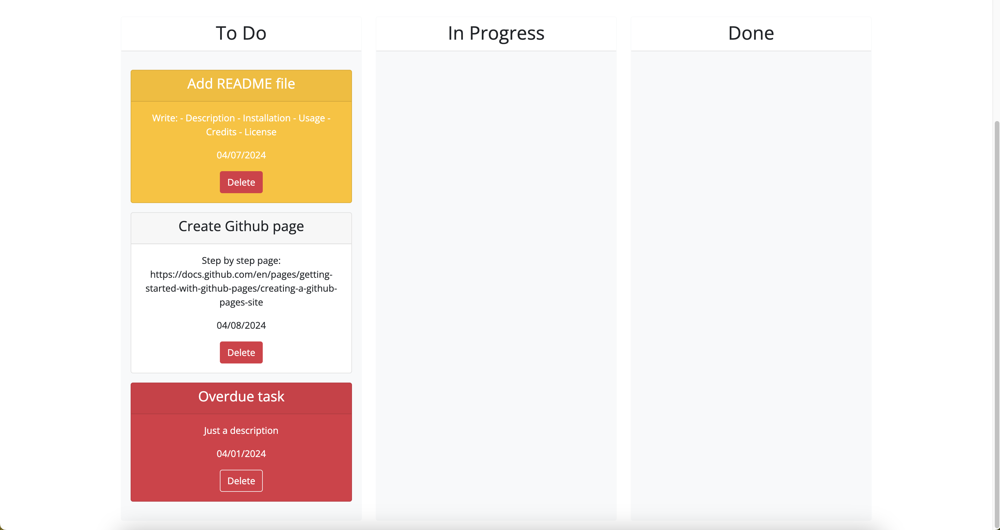
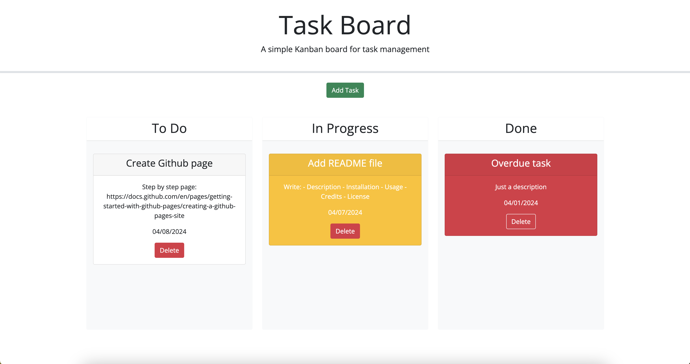
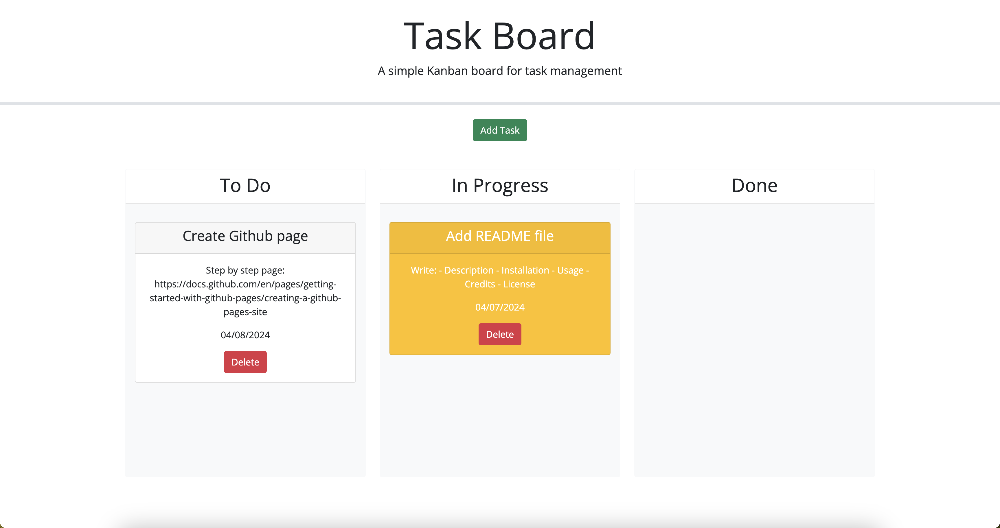

# Third-Party APIs Challenge: Task Board

## Description
Kanban board for task management allows you to identify if a task is for today or overdue based on the background color of the card. You can drag and drop the card across lanes as the task progresses, delete it when necessary, and it will persist even after refreshing the page.

## Installation
1. Clone the repository using the SSH key on your local machine with the command `git clone`, followed by the link provided by GitHub
2. Pull the project using the command `git pull`
3. Open the file index.html in your default browser.

## Usage
1. Open index.html in the default browser to view the website properly.
2. Click the 'Add Task' button and fill in the title, description, and due date in the modal.
3. If the task is overdue, the background of the card is red, and if it's for today, the background is yellow.
4. Drag the card to move it from the to-do lane to any other lane as the task progresses.
5. Delete the task if needed by clicking the delete button.
6. Refresh the page to ensure that the cards remain.

It should resemble the images below.
  
  
  
  

## Credits
[Bootstrap | Modal](https://getbootstrap.com/docs/5.3/components/modal/)

[Bootstrap | Cards](https://getbootstrap.com/docs/5.3/components/card/)

[StackOverflow | How to delete a specific item/object in localStorage?](https://stackoverflow.com/questions/28362404/how-to-delete-a-specific-item-object-in-localstorage)

[Quora | How can you generate unique numbers in JavaScript?](https://www.quora.com/How-can-you-generate-unique-numbers-in-JavaScript)

[Youtube | Learn CRUD Operations in JavaScript by building TODO APP || JS](https://www.youtube.com/watch?v=fL9cts8ykbU&t=5446s)

[jQuery user interface | Droppable Widget](https://api.jqueryui.com/droppable/#event-drop)

## License
This blog is open-source and available under the MIT License.